# CineData Analytics — GenAI Movie Intelligence Agent

[](https://python.org)
[](https://fastapi.tiangolo.com)
[](https://langchain-ai.github.io/langgraph/)
[](https://sqlite.org)
[](https://react.dev)
[](https://www.typescriptlang.org)
[](https://tailwindcss.com)
[](https://www.chartjs.org/)
[](https://docs.astral.sh/uv/)
[](https://bun.sh)

## 📑 Tabela de Conteúdos (Table of Contents)

- [📸 Demonstração da Interface (Showcase)](#demonstracao-da-interface-showcase)
- [🤖 Configuração da Inferência do Modelo (LLM Setup)](#configuracao-da-inferencia-do-modelo-llm-setup)
  - [Opção 1: Execução Local com Qwen3-4B Llamafile (Recomendado Offline)](#opcao-1-execucao-local-com-qwen3-4b-llamafile-recomendado-offline)
  - [Opção 2: Execução Local com Ollama via Docker](#opcao-2-execucao-local-com-ollama-via-docker)
  - [Opção 3: Provedores em Nuvem (Groq, Google Gemini, OpenRouter)](#opcao-3-provedores-em-nuvem-groq-google-gemini-openrouter)
- [🏛️ Visão Geral & Arquitetura](#visao-geral-arquitetura)
- [🔄 Máquina de Estados Finita (LangGraph FSM)](#maquina-de-estados-finita-langgraph-fsm)
- [🎯 Perguntas que o Sistema é Capaz de Responder](#perguntas-que-o-sistema-e-capaz-de-responder)
  - [1. Análises Relacionais (Text-to-SQL)](#1-analises-relacionais-text-to-sql)
  - [2. Visualizações & Gráficos Declarativos](#2-visualizacoes-graficos-declarativos)
  - [3. Busca Semântica Direta (RAG Qualitativo)](#3-busca-semantica-direta-rag-qualitativo)
  - [4. Busca Semântica Híbrida (Vetor + SQL Relacional)](#4-busca-semantica-hibrida-vetor-sql-relacional)
- [🚀 Capabilities do Sistema & Diferenciais](#capabilities-do-sistema-diferenciais)
- [🗄️ Estrutura do Data Lakehouse (Camada Gold)](#estrutura-do-data-lakehouse-camada-gold)
- [🛠️ Guia de Execução & Setup Rápido](#guia-de-execucao-setup-rapido)
  - [1. Configurar Variáveis de Ambiente](#1-configurar-variaveis-de-ambiente)
  - [2. Setup Automático em Um Comando](#2-setup-automatico-em-um-comando)
    - [2.1 Linux / macOS / WSL](#21-linux-macos-wsl)
    - [2.2 Windows (PowerShell)](#22-windows-powershell)
  - [3. Setup Manual Passo a Passo](#3-setup-manual-passo-a-passo)
    - [Etapa A: Descompactação do Banco SQLite (Dump .sql / .xz)](#etapa-a-descompactacao-do-banco-sqlite-dump-sql-xz)
    - [Etapa B: Geração do Contexto GenAI e Vetorização](#etapa-b-geracao-do-contexto-genai-e-vetorizacao)
    - [Etapa C: Execução Manual no Linux / WSL](#etapa-c-execucao-manual-no-linux-wsl)
    - [Etapa D: Execução Manual no Windows](#etapa-d-execucao-manual-no-windows)

---

<a id="demonstracao-da-interface-showcase"></a>
## 📸 Demonstração da Interface (Showcase)

### Visão Geral do Sistema & Chat
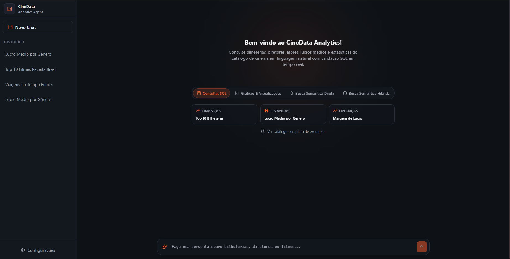
<sub>*Interface analítica moderna com streaming SSE e histórico persistente*</sub>

---

### Suporte a Múltiplos Provedores LLM
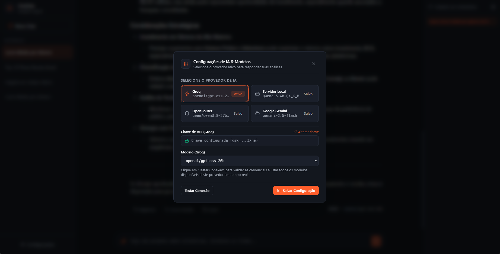
<sub>*Configuração dinâmica de LLM: OpenRouter, LM Studio, Ollama, Llamafile/Llama.cpp*</sub>

---

### Visualização em Barras (Chart.js)
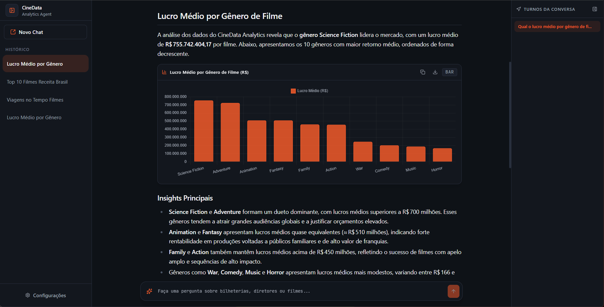
<sub>*Geração declarativa automática de métricas financeiras e comparativos*</sub>

---

### Gráficos de Rosca / Donut
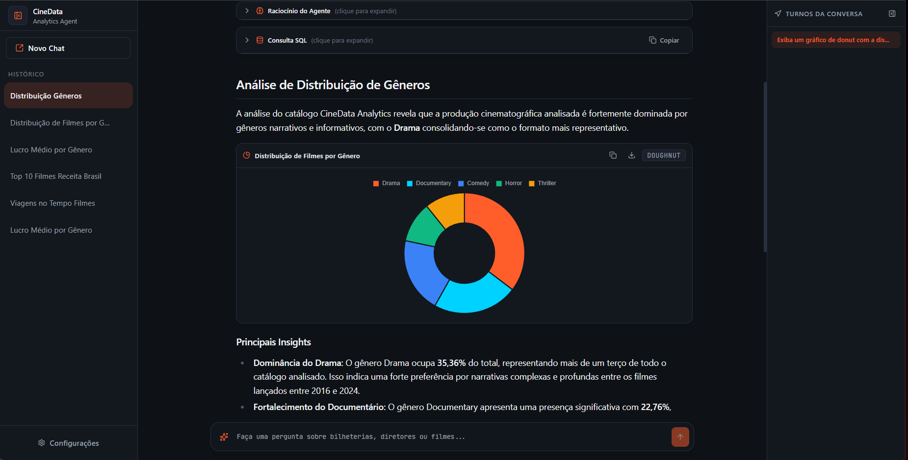
<sub>*Distribuição de catálogos e agrupamentos analíticos interativos*</sub>

---

### Gráficos de Pizza & Proporções
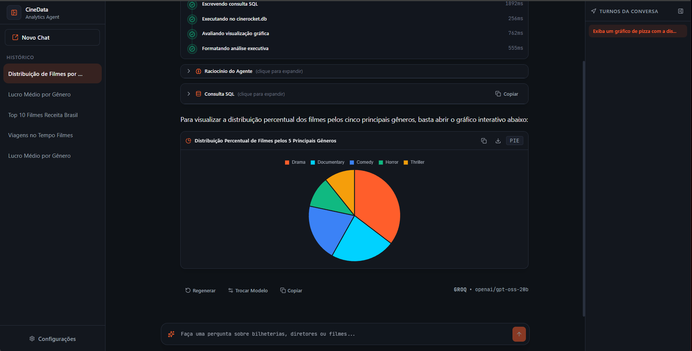
<sub>*Detalhamento de proporção por gêneros e status de produção*</sub>

---

### Tabelas com Ordenação & Exportação
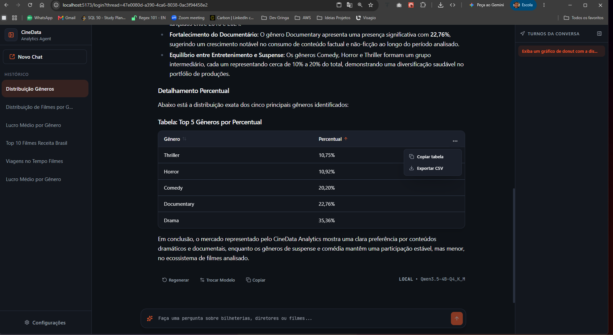
<sub>*Visualização tabular com ordenação de colunas e exportação CSV/JSON*</sub>

---

### Raciocínio, Passos & Query SQL Executada
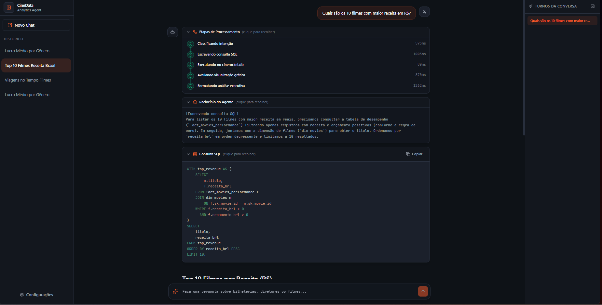
<sub>*Transparência auditável: inspeção da query SQL, AST validada e steps do agente*</sub>

---

### Ações do Chat & Sugestões Guiadas
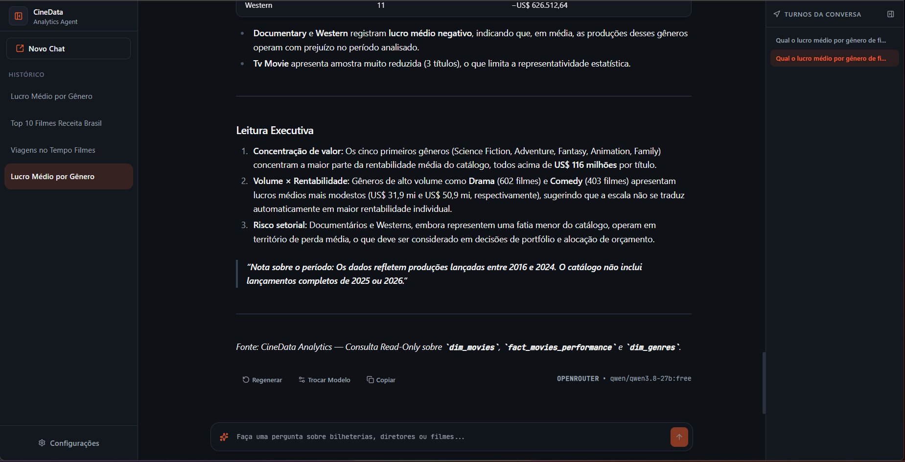
<sub>*Ações rápidas, categorização de prompts e cópia/regeneração de respostas*</sub>

---

### Comandos Rápidos (Slash Commands)
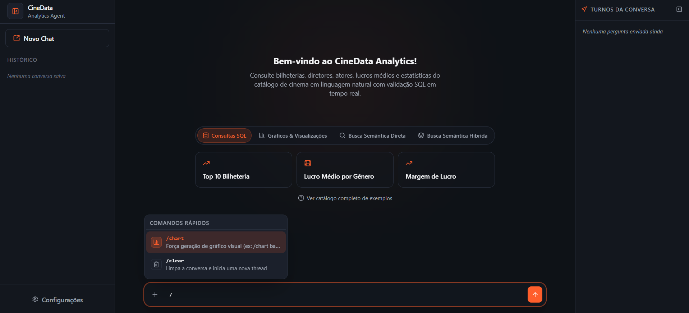
<sub>*Menu flutuante de atalhos de barra (`/chart`, `/clear`) com navegação rápida por teclado e acionamento inteligente*</sub>

---

### Preview Contextual de Filmes (Tooltip no Hover)
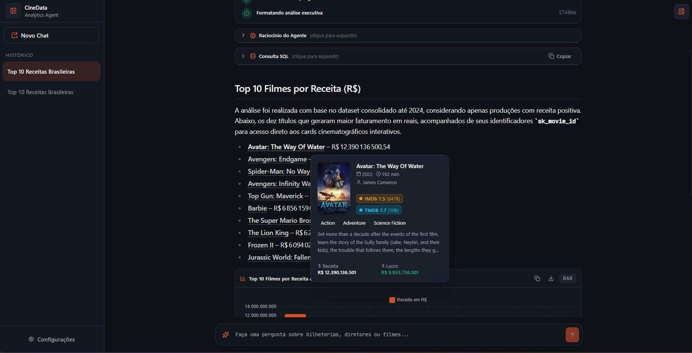
<sub>*Detecção inteligente de entidades: ao passar o mouse sobre o título de qualquer filme mencionado na resposta, um card interativo exibe poster, nota, sinopse e metadados contextuais*</sub>

---

### Resiliência & Fallback de Provedor sob Falhas
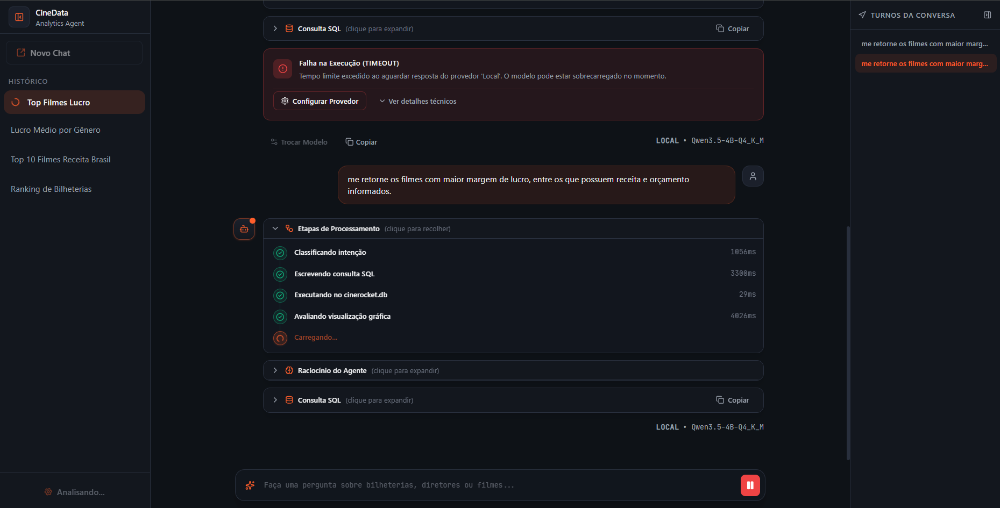
<sub>*Tolerância a falhas na conversa: detecção graciosa de timeouts ou sobrecarga do modelo com diagnóstico imediato, atalho para reconfigurar/trocar de provedor e prosseguimento transparente do chat sem perda de histórico*</sub>

---

<a id="configuracao-da-inferencia-do-modelo-llm-setup"></a>
## 🤖 Configuração da Inferência do Modelo (LLM Setup)

O **CineData Analytics** é 100% agnóstico a provedores de LLM. Você pode rodar a inferência localmente na sua máquina (sem custos de cota e com privacidade total) ou utilizar provedores em nuvem via API.

<p align="center">
  
  <br>
  <sub><b>Configuração 100% via Interface Gráfica:</b> Basta abrir as configurações de modelo na barra superior da UI, escolher o provedor, colar sua API key e testar a conexão com 1 clique! Todas as chaves salvas via interface são <b>criptografadas de forma reversível com Fernet (AES-128-CBC)</b> no banco de dados SQLite interno (<code>app_settings.db</code>). Se preferir, você também pode preencher as variáveis no arquivo <code>.env</code>.</sub>
</p>

### Visão Geral das Opções de Integração

1. **Llamafile Local (Zero Setup):** Arquivo único executável que roda o modelo sem instalar dependências extras de Python/C++.
2. **Ollama via Docker:** Para quem prefere containers padronizados com suporte a aceleração de GPU ou CPU.
3. **Provedores Cloud (Groq, Google Gemini, OpenRouter):** Respostas ultra-rápidas em milissegundos sem consumo de memória RAM/VRAM local.

> [!TIP]
> **Tamanho Mínimo Recomendado:** Recomendamos modelos com no mínimo **4 bilhões de parâmetros (4B)** — como a família **Qwen3-4B** ou superior. Modelos menores (< 3B) costumam ter dificuldades em raciocínio relacional e validação rígida de SQL, podendo alucinar nomes de colunas.

---

### Detalhes de Cada Alternativa de Inferência

<a id="opcao-1-execucao-local-com-qwen3-4b-llamafile-recomendado-offline"></a>
<details>
<summary><b>Opção 1: Execução Local com Qwen3-4B Llamafile (Recomendado Offline)</b></summary>

O [Mozilla AI Qwen3-4B-llamafile](https://huggingface.co/mozilla-ai/Qwen3-4B-llamafile) empacota o modelo e os binários de inferência em um único arquivo multiplataforma baseado em `llamafile`.

#### No Linux / WSL (Windows Subsystem for Linux)
1. Baixe o executável do modelo:
   ```bash
   curl -L -o Qwen3-4B.llamafile https://huggingface.co/mozilla-ai/Qwen3-4B-llamafile/resolve/main/Qwen3-4B.llamafile
   ```
2. Conceda permissão de execução:
   ```bash
   chmod +x Qwen3-4B.llamafile
   ```
3. Execute o servidor de inferência local na porta padrão (8080):
   ```bash
   ./Qwen3-4B.llamafile --nobrowser --port 8080
   ```

#### No Windows Nativo (Prompt de Comando ou PowerShell)
1. Faça o download direto do arquivo `Qwen3-4B.llamafile` pelo link do Hugging Face.
2. Renomeie o arquivo para adicionar a extensão `.exe` (ex: `Qwen3-4B.llamafile.exe`).
3. Abra o terminal na pasta e execute:
   ```powershell
   .\Qwen3-4B.llamafile.exe --nobrowser --port 8080
   ```

#### Como Conectar ao CineData:
* **Na UI:** Selecione o provedor **Local**, informe a Base URL `http://localhost:8080/v1` e nomeie o modelo como `Qwen3-4B`.
* **No `.env`:** Defina `LLM_PROVIDER=local` e `LLM_BASE_URL=http://localhost:8080/v1`.

</details>

<a id="opcao-2-execucao-local-com-ollama-via-docker"></a>
<details>
<summary><b>Opção 2: Execução Local com Ollama via Docker</b></summary>

Se você utiliza Docker, o Ollama fornece uma maneira isolada e pronta para uso:

1. **Subir o container Ollama (com ou sem GPU):**
   ```bash
   # Com aceleração de CPU padrão:
   docker run -d -v ollama_models:/root/.ollama -p 11434:11434 --name cinedata-ollama ollama/ollama

   # (Opcional) Com GPU NVIDIA instalada:
   # docker run -d --gpus=all -v ollama_models:/root/.ollama -p 11434:11434 --name cinedata-ollama ollama/ollama
   ```
2. **Baixar um modelo adequado (mínimo 4B):**
   ```bash
   docker exec -it cinedata-ollama ollama run qwen2.5:7b
   # ou
   docker exec -it cinedata-ollama ollama run llama3.2:3b
   ```

#### Como Conectar ao CineData:
* **Na UI:** Selecione o provedor **Local**, informe a Base URL `http://localhost:11434/v1` e clique em *Testar Conexão* (o sistema listará automaticamente os modelos instalados no Ollama!).
* **No `.env`:** Defina `LLM_PROVIDER=local`, `LLM_BASE_URL=http://localhost:11434/v1` e `LLM_MODEL=qwen2.5:7b`.

</details>

<a id="opcao-3-provedores-em-nuvem-groq-google-gemini-openrouter"></a>
<details>
<summary><b>Opção 3: Provedores em Nuvem (Groq, Google Gemini, OpenRouter)</b></summary>

Caso não deseje alocar memória local, você pode obter uma chave de API gratuita e colar diretamente na interface ou no arquivo `.env`:

* ⚡ **[Groq Cloud](https://console.groq.com/keys):** Inferência ultra-rápida (LPU) com suporte a `llama-3.3-70b-versatile`. Obtenha sua chave no [Groq API Keys](https://console.groq.com/keys).  
  *Variável no `.env`:* `GROQ_API_KEY=gsk_...`
* 🌐 **[OpenRouter](https://openrouter.ai/settings/keys):** Agregador com acesso a dezenas de modelos gratuitos com sufixo `:free` (ex: `meta-llama/llama-3.3-70b-instruct:free`). Obtenha sua chave no [OpenRouter Keys](https://openrouter.ai/settings/keys).  
  *Variável no `.env`:* `OPENROUTER_API_KEY=sk-or-v1-...`
* ♊ **[Google AI Studio](https://aistudio.google.com/app/apikey):** Acesso a modelos Gemini de ponta como `gemini-2.5-flash`. Crie sua chave no [Google AI Studio](https://aistudio.google.com/app/apikey).  
  *Variável no `.env`:* `GEMINI_API_KEY=AIzaSy...`

*Todas as chaves informadas via interface ficam salvas com segurança no banco interno `app_settings.db` e nunca são exibidas em texto puro nos logs da aplicação.*

</details>

---

<a id="visao-geral-arquitetura"></a>
## 🏛️ Visão Geral & Arquitetura

O sistema atua como uma ponte analítica entre tomadores de decisão de negócio e a camada Gold do Lakehouse dimensional (`cinerocket.db`). 

Em vez de depender de tool-calling repetitivo e cego para inspeção de tabelas (que consumiria cotas de LLM e elevaria a latência), o agente opera sobre uma **Máquina de Estados Finita (FSM)** orquestrada com **LangGraph**, aplicando:
1. **Catálogo Semântico Compacto Embutido** (~600 tokens) para geração de SQL *Zero-Shot*.
2. **Validação Estrita de AST & Read-Only Sandbox** contra comandos DDL/DML destrutivos.
3. **Loop de Auto-Recuperação de Erros SQL** com autocorreção em até 3 tentativas.
4. **Motor Vetorial Híbrido** com embeddings multilingual (`sentence-transformers/paraphrase-multilingual-MiniLM-L12-v2`) sobre sinopses e resenhas em português.
5. **Streaming em Tempo Real (SSE)** com renderização desacoplada de dados tabulares e gráficos **Chart.js**.

---

<a id="maquina-de-estados-finita-langgraph-fsm"></a>
## 🔄 Máquina de Estados Finita (LangGraph FSM)

O fluxo do agente é modelado como um grafo de estados determinístico:

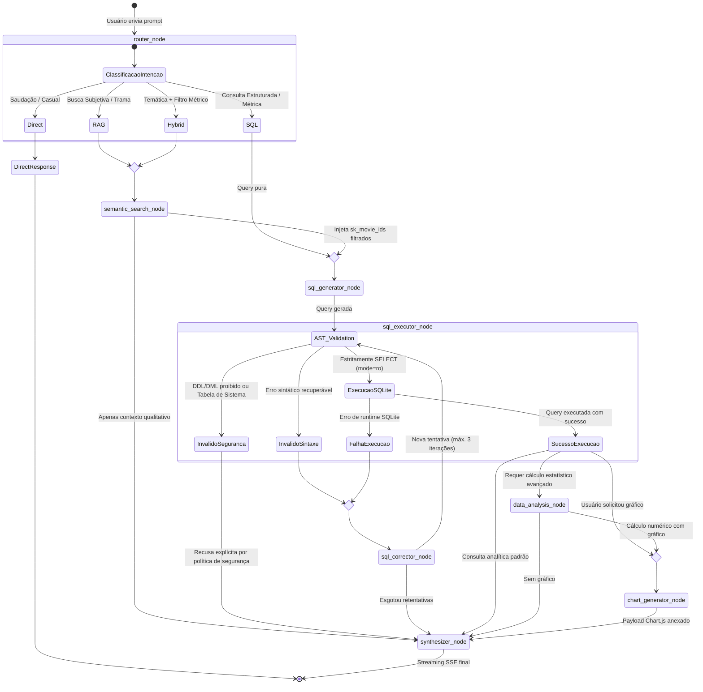

### Detalhamento dos Nós de Execução

| Nó do Grafo | Papel Técnico | Comportamento de Transição |
| :--- | :--- | :--- |
| **`router_node`** | Classifica a intenção semântica da pergunta. | Roteia para RAG, Híbrido, SQL puro ou Resposta Direta casual. |
| **`semantic_search_node`** | Executa busca vetorial k-NN por cosseno nas sinopses e resenhas. | Se for RAG puro, vai para o sintetizador; se for Híbrido, encaminha os IDs para o gerador SQL. |
| **`sql_generator_node`** | Constrói a query SQL baseando-se no catálogo semântico compacto. | Bloqueia intenções destrutivas na raiz e envia a query para validação AST. |
| **`sql_executor_node`** | Valida AST (proíbe escrita) e executa no SQLite com conexão `mode=ro`. | Dispara para o corretor em erros de sintaxe ou para análise/gráfico em sucesso. |
| **`sql_corrector_node`** | Analisa o traceback retornado pelo SQLite e regenera a query. | Loop de auto-recuperação (até 3 tentativas); nunca recupera violações de segurança. |
| **`data_analysis_node`** | Computa estatísticas descritivas complexas quando necessário. | Encaminha dados processados para gráfico ou síntese. |
| **`chart_generator_node`** | Gera configuração declarativa `ChartJsConfigDTO` (barras, linha, pizza, rosca). | Anexa payload visual para renderização imediata no frontend. |
| **`synthesizer_node`** | Compila a resposta executiva formatada em Markdown com tabelas e insights. | Envia blocos via Server-Sent Events (SSE) para o usuário. |

---

<a id="perguntas-que-o-sistema-e-capaz-de-responder"></a>
## 🎯 Perguntas que o Sistema é Capaz de Responder

O agente foi projetado para cobrir todas as demandas da atividade oficial CineData Analytics e expandido com busca semântica avançada:

<a id="1-analises-relacionais-text-to-sql"></a>
### 1. Análises Relacionais (Text-to-SQL)
* **Top 10 Bilheteria:** *"Quais são os 10 filmes com maior receita em R$?"*  
  *(Consulta `fact_movies_performance` ordenada por `receita_brl DESC` com junção em `dim_movies`).*
* **Lucro Médio por Gênero:** *"Qual o lucro médio por gênero de filme?"*  
  *(Aplica a regra de ouro de negócio: `WHERE receita_brl > 0 AND orcamento_brl > 0` agrupado por `dim_genres`).*
* **Margem de Lucro Máxima:** *"Quais filmes possuem a maior margem de lucro percentual?"*  
  *(Calcula `(lucro_brl / receita_brl) * 100` filtrando orçamentos válidos).*
* **Popularidade TMDB:** *"Quais são os 5 filmes mais populares de acordo com o TMDB?"*  
  *(Ordenação por score de popularidade da camada Gold).*
* **Divergência Crítica vs. Público:** *"Quais filmes apresentam a maior divergência entre a nota TMDB e a nota IMDb?"*  
  *(Cálculo de `ABS(nota_tmdb - nota_imdb)` destacando incongruências de recepção).*
* **Evolução da Crítica:** *"Qual a nota média IMDb dos filmes por ano de lançamento?"*  
  *(Média ponderada agrupada por `ano_lancamento` entre 2016 e 2026).*
* **Atores Mais Ativos:** *"Qual ator possui mais participações em filmes nos últimos 5 anos?"*  
  *(Junção relacional N:N via `bridge_movie_person` filtrando `tipo_pessoa = 'Ator'`).*
* **Diretores Consagrados:** *"Quais diretores têm a maior nota média com pelo menos 5 filmes dirigidos?"*  
  *(Filtro `HAVING COUNT(sk_movie_id) >= 5` sobre `dim_people`).*
* **Rentabilidade por Estúdio:** *"Qual produtora obteve o maior lucro total acumulado?"*  
  *(Agregação sobre `bridge_movie_company` e `dim_companies`).*

<a id="2-visualizacoes-graficos-declarativos"></a>
### 2. Visualizações & Gráficos Declarativos
* **Gráfico de Barras Financeiro:** *"Gere um gráfico de barras com as 5 produtoras mais lucrativas do catálogo."*
* **Distribuição em Pizza/Rosca:** *"Exiba um gráfico de pizza com a distribuição percentual de filmes pelos 5 principais gêneros."*
* **Série Temporal de Notas:** *"Trace a evolução da nota média dos filmes no IMDb ao longo dos anos."*
* **Comparativo Setorial:** *"Mostre um gráfico comparativo de faturamento dos top 5 filmes de ficção científica."*
* **Volume Histórico:** *"Exiba um gráfico de linha comparando a quantidade de lançamentos por ano entre 2016 e 2026."*
* **Status do Pipeline:** *"Qual a proporção de filmes lançados vs em produção no catálogo?"*

<a id="3-busca-semantica-direta-rag-qualitativo"></a>
### 3. Busca Semântica Direta (RAG Qualitativo)
* **Conceitos de Ficção Científica:** *"Encontre filmes que falem sobre viagens no tempo ou realidades paralelas."*  
  *(Recuperação por proximidade de embeddings nas sinopses de `dim_movies` sem necessidade de SQL).*
* **Sentimentos em Avaliações:** *"Procure resenhas em que os usuários tenham elogiado a reviravolta no final (plot twist)."*  
  *(Busca semântica nos comentários de `movie_reviews` identificando recepção emocional).*
* **Temas Contemporâneos:** *"Identifique filmes sobre inteligência artificial ou ciborgues."*
* **Superação e Dramas:** *"Busque filmes com sinopses sobre superação de perdas familiares ou desafios esportivos."*

<a id="4-busca-semantica-hibrida-vetor-sql-relacional"></a>
### 4. Busca Semântica Híbrida (Vetor + SQL Relacional)
* **Sci-Fi com Finanças:** *"Encontre filmes que falem sobre viagens no tempo ou realidades paralelas e mostre o orçamento e a nota IMDb de cada um."*  
  *(A FSM localiza os IDs mais similares via vetor e injeta uma cláusula `WHERE sk_movie_id IN (...)` no gerador de SQL).*
* **Plot Twist & Reputação:** *"Procure resenhas em que os usuários elogiaram o plot twist e me diga qual foi a nota desses filmes."*
* **IA de Alto Faturamento:** *"Identifique filmes sobre inteligência artificial ou ciborgues que tenham faturado mais de 100 milhões de dólares."*  
  *(Combina filtro vetorial temático com métrica `receita_brl > 100000000`).*
* **Dramas de Alta Avaliação:** *"Busque filmes com sinopses sobre superação de perdas familiares com nota de usuário acima de 8.0."*

---

<a id="capabilities-do-sistema-diferenciais"></a>
## 🚀 Capabilities do Sistema & Diferenciais

- 🛡️ **Zero Vulnerability & Read-Only Governance:** Validação de AST impede comandos `DROP`, `DELETE`, `UPDATE` ou acesso a tabelas de sistema do SQLite. Abertura do SQLite em modo estritamente `mode=ro`.
- 🔁 **Self-Healing SQL Loop:** Capacidade de autocorreção automática com até 3 iterações perante eventuais erros de sintaxe ou funções inexistentes.
- ⚡ **Resiliência & Troca de Modelo sob Falhas:** Tratamento amigável de timeouts ou indisponibilidades de modelos (ex.: LLM local sobrecarregado), com modal direto para alternar provedor/modelo sem perder o histórico do chat.
- 🌐 **Agnóstico a Provedores de LLM:** Suporte plug-and-play para **OpenRouter** (`:free`), **Groq**, **Google Gemini**, **LM Studio**, **Ollama**, e executáveis locais **Llamafile**.
- 📊 **Visualização Multimodal:** Renderização dinâmica de gráficos com **Chart.js** (barras, linha, rosca, pizza) e tabelas interativas com ordenação e exportação de dados.
- 🔍 **RAG Multilíngue Híbrido:** Embeddings sobre português brasileiro cobrindo tanto tramas ficcionais quanto sentimentos de resenhas de usuários.
- 🎬 **Preview Contextual no Hover:** Detecção em tempo real de entidades de filmes no texto das respostas; passar o cursor sobre o título aciona um tooltip/popover flutuante com dados essenciais, pôster, nota e sinopse sem tirar o usuário do fluxo.
- ⌨️ **Comandos Rápidos (Slash Commands):** Menu popover com suporte a navegação por teclado acionado ao digitar `/` (ex.: `/chart` para forçar visualizações gráficas e `/clear` para reset rápido de contexto).
- 🏷️ **Geração Concorrente de Títulos:** Sub-rotina desacoplada assíncrona que sintetiza o título da conversa em ~200ms sem bloquear o streaming principal.
- 🌊 **Streaming SSE com Indicador de Raciocínio:** Feedback em tempo real com exibição dos passos de pensamento, nós visitados e query SQL executada.

---

<a id="estrutura-do-data-lakehouse-camada-gold"></a>
## 🗄️ Estrutura do Data Lakehouse (Camada Gold)

O agente interage com o banco dimensional SQLite (`cinerocket.db`), estruturado nas seguintes tabelas:

```
cinerocket.db (Star Schema)
│
├── fact_movies_performance (Fato: orçamento, receita, lucro, notas, popularidade)
│
├── dim_movies             (Dimensão: título, sinopse, ano, duração, status)
├── dim_people             (Dimensão: atores, diretores, roteiristas)
├── dim_genres             (Dimensão: gêneros padronizados em inglês)
├── dim_companies          (Dimensão: produtoras e estúdios)
├── dim_reviews            (Dimensão: métricas consolidadas de avaliações)
├── movie_reviews          (Fato/Texto: resenhas individuais em português para RAG)
│
└── Tabelas de Associação (N:N)
    ├── bridge_movie_person
    ├── bridge_movie_genre
    └── bridge_movie_company
```

---

<a id="guia-de-execucao-setup-rapido"></a>
## 🛠️ Guia de Execução & Setup Rápido

O projeto conta com um script orquestrador universal que configura ambientes, descompacta a base de dados SQLite se necessário e inicializa os serviços.

### Pré-requisitos Recomendados
* **Python 3.12+** gerenciado com **`uv`** (recomendado para alta performance) ou `python3-venv`.
* **Node.js** com **`bun`** (recomendado) ou `npm`.

<a id="1-configurar-variaveis-de-ambiente"></a>
### 1. Configurar Variáveis de Ambiente
```bash
cp .env.example .env
```
*(Você pode preencher as credenciais no arquivo `.env` ou configurá-las diretamente pela interface web).*

---

<a id="2-setup-automatico-em-um-comando"></a>
### 2. Setup Automático em Um Comando

O projeto possui orquestradores inteligentes que detectam os runtimes instalados (**`uv`** / **`pip`**, **`bun`** / **`npm`**), configuram o ambiente virtual, descompactam a base de dados se necessário, geram os vetores de busca e iniciam o backend e o frontend simultaneamente.

<a id="21-linux-macos-wsl"></a>
#### 2.1 Linux / macOS / WSL

Abra o terminal na raiz do projeto e execute:
```bash
# Conceder permissão de execução (se necessário)
chmod +x setup.sh

# Inicialização automática completa
./setup.sh
```

<a id="22-windows-powershell"></a>
#### 2.2 Windows (PowerShell)

Abra o terminal do PowerShell na raiz do projeto e execute:
```powershell
.\setup.ps1
```

> [!WARNING]
> **Aviso de Política de Execução no Windows (`ExecutionPolicy`):**  
> Caso o Windows exiba o erro *"o arquivo não pode ser carregado porque a execução de scripts foi desabilitada neste sistema"* (`PSSecurityException`), execute o script liberando a política temporariamente apenas para a sessão atual:
> ```powershell
> powershell -ExecutionPolicy Bypass -File .\setup.ps1
> ```
> Ou habilite para o seu usuário atual no PowerShell:
> ```powershell
> Set-ExecutionPolicy -Scope CurrentUser -ExecutionPolicy RemoteSigned
> ```

---

<a id="3-setup-manual-passo-a-passo"></a>
### 3. Setup Manual Passo a Passo

Caso prefira configurar e rodar cada camada manualmente, siga o fluxo detalhado abaixo:

<a id="etapa-a-descompactacao-do-banco-sqlite-dump-sql-xz"></a>
#### Etapa A: Descompactação do Banco SQLite (Dump `.sql` / `.xz`)

O catálogo analítico depende da base `cinerocket.db` na raiz do projeto. Caso você tenha apenas o dump compactado (`database.sql.xz`) ou o arquivo `.sql` (`database_dump.sql`):

* **Opção 1 (Via Linux / WSL com ferramentas de sistema):**
  ```bash
  # Se possuir database.sql.xz:
  xz -dc database.sql.xz | sqlite3 cinerocket.db

  # Ou se possuir database_dump.sql:
  sqlite3 cinerocket.db < database_dump.sql
  ```

* **Opção 2 (Via Python nativo — funciona em Windows e Linux sem ferramentas externas):**
  ```bash
  # Descompactando database.sql.xz via Python:
  python3 -c "import sqlite3, lzma; conn = sqlite3.connect('cinerocket.db'); conn.executescript(lzma.open('database.sql.xz', 'rt', encoding='utf-8').read()); conn.close()"

  # Ou restaurando database_dump.sql:
  python3 -c "import sqlite3; conn = sqlite3.connect('cinerocket.db'); conn.executescript(open('database_dump.sql', 'r', encoding='utf-8').read()); conn.close()"
  ```

<a id="etapa-b-geracao-do-contexto-genai-e-vetorizacao"></a>
#### Etapa B: Geração do Contexto GenAI e Vetorização

O agente utiliza uma coluna pré-agregada `genai_context` em `fact_movies_performance` e uma tabela virtual vetorial `vec_movies` (`sqlite-vec`). Para gerar ou atualizar essa estrutura com aceleração de hardware (GPU NVIDIA CUDA com FP16, Apple Silicon MPS ou CPU multi-thread):

* **Com `uv` (Recomendado):**
  ```bash
  cd backend
  uv run python scripts/generate_genai_context.py --batch-size 64
  ```
* **Com ambiente virtual tradicional (`pip` / `venv`):**
  ```bash
  cd backend
  source .venv/bin/activate  # No Windows: .venv\Scripts\Activate.ps1
  python scripts/generate_genai_context.py --batch-size 64
  ```

<a id="etapa-c-execucao-manual-no-linux-wsl"></a>
#### Etapa C: Execução Manual no Linux / WSL

1. **Instalar dependências e iniciar o Backend:**
   ```bash
   cd backend
   uv sync --all-extras
   uv run uvicorn app.main:app --host 0.0.0.0 --port 8000 --reload
   ```
2. **Em outro terminal, instalar dependências e iniciar o Frontend:**
   ```bash
   cd frontend
   bun install
   bun run dev
   ```

<a id="etapa-d-execucao-manual-no-windows"></a>
#### Etapa D: Execução Manual no Windows

1. **Instalar dependências e iniciar o Backend:**
   ```powershell
   cd backend
   # Com uv:
   uv sync --all-extras
   uv run uvicorn app.main:app --host 0.0.0.0 --port 8000 --reload

   # Ou com pip tradicional:
   python -m venv .venv
   .\.venv\Scripts\Activate.ps1
   pip install -e ".[dev]"
   uvicorn app.main:app --host 0.0.0.0 --port 8000 --reload
   ```
2. **Em outro terminal, instalar dependências e iniciar o Frontend:**
   ```powershell
   cd frontend
   # Com bun:
   bun install
   bun run dev

   # Ou com npm:
   npm install
   npm run dev
   ```

---

Acesse a interface visual em **`http://localhost:5173`** e os endpoints interativos da API em **`http://localhost:8000/docs`**.
