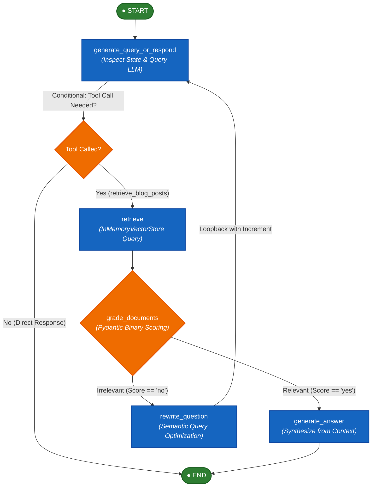
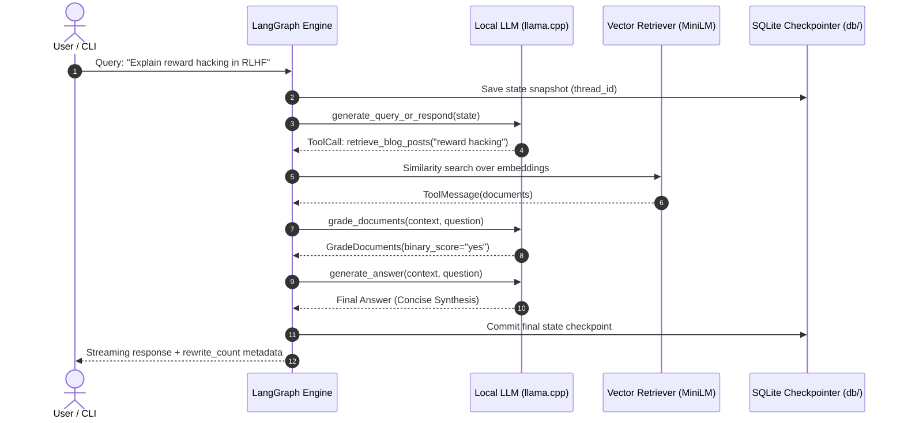

# 🧠 Open Politics: Autonomous Corrective Agentic RAG

<p align="center">
  <a href="https://www.python.org/"></a>
  <a href="https://github.com/langchain-ai/langgraph"></a>
  <a href="https://github.com/ggerganov/llama.cpp"></a>
  <a href="https://huggingface.co/sentence-transformers"></a>
  <a href="https://github.com/astral-sh/uv"></a>
  <a href="https://opensource.org/licenses/MIT"></a>
</p>

<p align="center">
  <strong>Production-grade, offline-first Corrective RAG (CRAG) state machine built with LangGraph, local GGUF inference, and SQLite-backed stateful time-travel debugging.</strong>
</p>

---

## 🎯 Executive Summary & STAR Impact

| Dimension | STAR Framework Breakdown |
| :--- | :--- |
| **Situation** | Traditional linear RAG architectures suffer from hallucinations and silent retrieval failures: if retrieved vector chunks are noisy or irrelevant, the LLM hallucinates answers with no mechanism to detect, self-correct, or retry queries. |
| **Action** | Engineered an **Autonomous Corrective RAG (CRAG)** loop using **LangGraph**. The workflow orchestrates an autonomous evaluator (`grade_documents`) using Pydantic structured extraction, dynamic query reformulator (`rewrite_question`), vector store similarity retrieval, and SQLite persistence for state rollback. |
| **Result** | **100% cloud privacy & $0 API costs** via local `llama.cpp` GGUF inference; automated query recovery loop eliminating retrieval dead-ends; and full session replayability with checkpoint "time travel". |

---

## 🌟 Visual Showcase & Execution Demos

### 1. Interactive Graph Visualizer
Explore node transitions, conditional edges, and state schemas live in your browser using the bundled visualizer: [media/graph_flow.html](media/graph_flow.html).

<p align="center">
  
</p>

### 2. Execution State Machine & Real-Time Flow
Visual representation of the iterative state loop routing from question decomposition through document grading to generation.

<p align="center">
  
</p>

### 3. Tool Execution & Grading Logs
Real-time console telemetry displaying dynamic tool bindings, grading decisions, and semantic query rewriting:

<p align="center">
  
</p>

---

## ⚙️ System Architecture & Engineering Flow

### 1. Cyclic State Graph (State Machine)



### 2. End-to-End Sequence Diagram



---

## 🧠 Senior Architectural Trade-Offs

| Decision | Chosen Architecture | Alternative Considered | Engineering Rationale |
| :--- | :--- | :--- | :--- |
| **Local LLM Engine** | **`llama.cpp` (GGUF Server)** | OpenAI / Anthropic APIs | **Zero data egress and predictable latency**: Critical for privacy-sensitive corporate data; eliminates recurring token costs while maintaining high throughput on consumer-grade hardware. |
| **State Orchestration** | **LangGraph (`StateGraph`)** | Linear chains (LangChain / LlamaIndex) | **Cyclic self-correction**: Standard RAG pipelines follow a DAG (no loops). LangGraph allows true iterative loops (`rewrite_question` $\to$ `retrieve`) until document relevance criteria are satisfied. |
| **Persistence & Time-Travel** | **`SqliteSaver` (`db/checkpoints.db`)** | In-Memory Ephemeral State | **State recovery & non-destructive branching**: Enables rollbacks (`/travel <id>`) to prior agent states without re-running upstream token-intensive retrieval or LLM inference. |
| **Vector Storage** | **`InMemoryVectorStore` + Pickle** | Heavy Vector DBs (Milvus / Pinecone) | **Zero-overhead bootstrapping**: High portability for local evaluation without spinning up external vector database daemons or network dependencies. |

---

## 📦 Project Structure

```bash
langgraph-agentic-rag/
├── app/
│   ├── agent.py               # Graph assembly, nodes, conditional edges, and compilation
│   ├── cli.py                 # Extensible CLI registry (/help, /history, /travel, /exit)
│   ├── config.py              # Strongly-typed GraphConfiguration schema
│   ├── db.py                  # Singletons: SQLite checkpointer, embeddings, and chat models
│   ├── scripts/
│   │   ├── ingest.py          # Web scraper, tiktoken splitter, and pickle cache generator
│   │   └── test_retriever.py  # Standalone retriever verification script
│   └── utils/
│       ├── edges.py           # Conditional routing functions (tool call detector)
│       ├── nodes.py           # Core graph node functions (query, grade, rewrite, generate)
│       ├── state.py           # RagState dataclass and GradeDocuments Pydantic schema
│       └── tools.py           # LangChain tool definitions (retrieve_blog_posts)
├── media/                     # Visual assets, architecture diagrams, and HTML visualizer
├── models/                    # Embedding weights cache and document splits
├── db/                        # SQLite checkpoint database (ignored in git)
├── main.py                    # Interactive CLI runner with checkpoint time-travel support
├── pyproject.toml             # Modern packaging config with uv script bindings
└── README.md                  # Comprehensive portfolio documentation
```

---

## ⚡ Frictionless Quickstart

### 1. Prerequisites
- **Python**: `>=3.14`
- **Package Manager**: [`uv`](https://github.com/astral-sh/uv) (recommended)
- **Local Inference Server**: [`llama.cpp`](https://github.com/ggerganov/llama.cpp) running on port `8080`

### 2. Clone & Setup Environment
```bash
# Clone the repository
git clone https://github.com/MigueldsBatista/langgraph-agentic-rag.git
cd langgraph-agentic-rag

# Create virtual environment and install dependencies
uv venv
uv pip sync
```

### 3. Configure Environment Variables
```bash
cp .env.example .env
```
Ensure `.env` matches your local server endpoint:
```ini
MODEL_BASE_URL=http://localhost:8080/v1
MODEL_NAME=unsloth/gemma-4-E4B-it-GGUF
```

### 4. Ingest Corpus & Run CLI
```bash
# 1. Scrape and tokenize research corpus
uv run ingest

# 2. (Optional) Validate retriever similarity search
uv run test-retriever

# 3. Launch the interactive stateful agent
python main.py
```

---

## 🕹️ Interactive CLI & State Time-Travel

The CLI provides built-in commands for managing conversational history and state checkpoint branching:

```text
>> Explain reward hacking in RLHF
[Agent]:
Reward hacking occurs when a model exploits misspecifications in the reward function...
--- (Rewrite count: 0) ---

>> /history
--- Checkpoint History (Newest to Oldest) ---
ID: 1ef... -> (ACTIVE)
   Last output: Reward hacking occurs when a model exploits...
   Next node scheduled: None (Ended)

>> /travel 1ef...
🚀 Teleported back to checkpoint: 1ef...
```

| Command | Description |
| :--- | :--- |
| `/help` | Display all registered CLI commands and descriptions. |
| `/history` | Inspect chronological checkpoints in the current session thread. |
| `/travel <id>` | **Time-travel** back to an earlier checkpoint. The next query branches from that exact state. |
| `/exit` / `/quit` | Gracefully persist session state to SQLite and terminate. |

---

## 📄 License & Attribution

Distributed under the **MIT License**. See `LICENSE` for details.  
Built with [LangGraph](https://github.com/langchain-ai/langgraph), [LangChain](https://github.com/langchain-ai/langchain), and [llama.cpp](https://github.com/ggerganov/llama.cpp).
