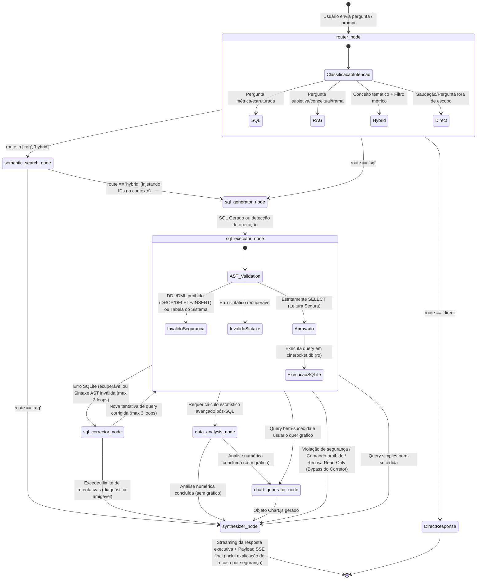

# Especificação Técnica do Núcleo de Inteligência Artificial: CineData Agent

Este documento especifica formalmente a arquitetura interna do agente, o catálogo de ferramentas (`tools`), a máquina de estados finitos (FSM do LangGraph), o contrato de dados para renderização declarativa com **Chart.js (`react-chartjs-2`)** e a taxonomia de perguntas padronizadas do catálogo.

---

## 1. Máquina de Estados do Agente (State Machine & Transitions)

O agente é orquestrado como um grafo direcionado com nós atômicos de decisão, execução e auto-recuperação (`StateGraph` do LangGraph).

### 1.1 Diagrama de Estados e Transições



### 1.2 Descrição dos Estados e Gatilhos de Transição

| Estado / Nó | Função Principal | Condição de Entrada | Próximo Estado |
| :--- | :--- | :--- | :--- |
| **`router_node`** | Analisa a intenção semântica da pergunta do usuário. | Entrada do grafo (`START`). | • `semantic_search_node` (se RAG ou Híbrido)<br>• `sql_generator_node` (se SQL)<br>• `DirectResponse` (se conversa casual). |
| **`semantic_search_node`** | Busca vetorial via Hugging Face em sinopses (`dim_movies`) e resenhas (`movie_reviews`). | Rota `rag` ou `hybrid`. | • `synthesizer_node` (se puramente qualitativo)<br>• `sql_generator_node` (repassando IDs de filmes encontrados). |
| **`sql_generator_node`** | Redige a query SQL baseando-se no dicionário de dados (`db-semantics.md`). Se a intenção for destrutiva (DROP, DELETE, limpeza de banco), recusa a geração e registra violação de política de leitura (*Read-Only*). | Rota `sql` ou após RAG híbrido. | `sql_executor_node`. |
| **`sql_executor_node`** | Valida a consulta via parser AST (`validate_sql_query`) e executa a query com driver SQLite em modo estritamente `mode=ro`. Em caso de violações de segurança ou recusas de escrita, sinaliza erro irrecuperável de política. | SQL gerado (ou erro de recusa de geração). | • `synthesizer_node` (se comando proibido/violação de segurança — **bypass do corretor**)<br>• `chart_generator_node` (se o usuário pediu gráfico)<br>• `data_analysis_node` (se requer estatística)<br>• `sql_corrector_node` (se erro técnico recuperável do SQLite)<br>• `synthesizer_node` (se consulta simples bem-sucedida). |
| **`sql_corrector_node`** | Loop de autocorreção: analisa a mensagem de erro do SQLite e refaz o SQL. *Nota: Comandos proibidos e violações de segurança nunca entram neste loop.* | Exceção técnica do SQLite ou sintaxe inválida. | `sql_executor_node` (até 3 tentativas) ou `synthesizer_node` se exceder o limite. |
| **`data_analysis_node`** | Executa a sandbox segura de código Python para cálculos estatísticos (variância, desvio). | Dataset retornado necessita cálculo avançado. | `chart_generator_node` ou `synthesizer_node`. |
| **`chart_generator_node`** | Estrutura o schema declarativo simplificado de dados (`ChartJsConfigDTO`). | Usuário solicitou gráfico ou padrão visual claro. | `synthesizer_node`. |
| **`synthesizer_node`** | Gera a resposta executiva final em linguagem natural formatada em Markdown. Explica formalmente restrições de governança (*Read-Only*) caso tenha havido tentativa de limpeza ou mutação. | Chegada de dados/gráficos prontos ou erro/recusa de segurança. | `END` (`[*]`). |

---

### 1.3 Estratégia de Alimentação de Schema: "Catálogo Semântico Compacto Embutido"

Uma decisão crítica de engenharia foi adotada para a geração de SQL: **Não usar tools dinâmicas de descoberta de schema (`list_tables`, `describe_table`) nem DDLs SQL brutos no prompt**.

#### Por que essa decisão foi tomada?
1. **Zero Chamadas Extras de LLM (Latência Mínima & Cota Preservada):**
   - No padrão ReAct tradicional do LangChain com tools de introspecção, o modelo precisa de 2 a 3 rodadas consecutivas só para "descobrir" quais tabelas existem. Isso esgotaria rapidamente o limite diário gratuito de APIs (ex: 50 reqs/dia do OpenRouter `:free`) e aumentaria a latência em 3 a 5 segundos.
2. **Eliminação de Ruído de DDL Bruto:**
   - DDLs brutos do SQLite contêm dezenas de linhas de hashes SHA-256 e constraints verbosas que poluem a janela de contexto sem agregar inteligência de negócio.
3. **Inclusão das Regras Semânticas Vitais:**
   - O SQLite não informa que `dim_genres.nome_genero` está em inglês (`'Horror'`, `'Comedy'`), nem que `tipo_pessoa` aceita estritamente `'Ator'`, `'Diretor'`, `'Roteirista'`, nem que dados financeiros exigem `WHERE receita_brl > 0`. Apenas um catálogo semântico compacto garante geração de SQL correta de primeira tentativa (Zero-Shot).

#### Como é implementado no `sql_generator_node`:
O nó Python injeta diretamente no System Prompt uma constante semântica compacta de ~600 tokens:
```text
SCHEMA DO BANCO CINEDATA (cinerocket.db):
- dim_movies: sk_movie_id, titulo, ano_lancamento (2016-2029), duracao_minutos, status_filme ('Lançado', 'Em Produção'), sinopse
- fact_movies_performance: sk_movie_id, orcamento_brl, receita_brl, lucro_brl, popularidade, nota_tmdb, nota_imdb, qtd_imdb
  * Regra Finanças: Sempre filtrar WHERE receita_brl > 0 AND orcamento_brl > 0 para margens e lucros médios válidos.
- dim_people: sk_person_id, nome_pessoa, tipo_pessoa ('Ator', 'Diretor', 'Roteirista')
- bridge_movie_person: sk_movie_id, sk_person_id (relação N:N)
- dim_genres: sk_genre_id, nome_genero ('Action', 'Comedy', 'Horror', 'Drama', 'Science Fiction', ...) [ATENÇÃO: nomes em inglês!]
- bridge_movie_genre: sk_movie_id, sk_genre_id (relação N:N)
- dim_companies: sk_company_id, nome_produtora
- bridge_movie_company: sk_movie_id, sk_company_id (relação N:N)
- dim_reviews: sk_movie_id, qtd_avaliacoes_usuarios, nota_media_usuarios (médias agregadas do portal)
- movie_reviews: sk_movie_id, rating, text (resenhas individuais em português)
```
*As tools do agente ficam dedicadas exclusivamente à execução do SQL (`execute_sql_query`), busca vetorial RAG e análise estatística.*

---

### 1.4 Geração Concorrente do Título de Conversa (Sub-rotina Desacoplada)

Para proporcionar a experiência clássica de produtos como Gemini/ChatGPT sem penalizar a latência da primeira resposta analítica:

1. **Execução Paralela Desacoplada do Grafo:** A geração de título **não é um nó sequencial** da FSM do LangGraph. Ela roda em paralelo via `asyncio.create_task` gerenciada pelo `AgentService` exclusivamente no 1º turno de uma nova conversa (`thread.title is None`).
2. **Reaproveitamento do Modelo Ativo com Trava Estrita de Tokens:** Em vez de instanciar outro modelo ou requerer múltiplos downloads de pesos na VRAM (crucial para provedores locais como LM Studio/Ollama), a sub-rotina reaproveita a mesma instância LLM ativa do usuário, aplicando apenas a trava:
   ```python
   # Reusa o modelo ativo com temperatura baixa e limite curto de tokens
   title_model = get_chat_model(temperature=0.3).bind(max_tokens=20)
   title_chain = title_prompt | title_model | StrOutputParser()
   ```
3. **Latência Mínima & Emissão SSE:** Com limite de ~20 tokens de saída, a resposta retorna em 100-250ms. Assim que o texto é obtido, o serviço despacha o evento SSE `{"type": "title", "title": clean_title}` e persiste o registro no banco de threads do SQLite.

---

## 2. Catálogo Oficial de Ferramentas (Tools Mapeadas)

O modelo de linguagem dispõe de um conjunto conciso de ferramentas fortemente tipadas através do `@tool` do `langchain_core`:

### Tool 1: `execute_sql_query`
* **Arquivo:** `app/agent/tools/query_runner.py`
* **Objetivo:** Executar queries SQL analíticas de leitura no `cinerocket.db`.
* **Segurança:** Rejeita queries sem `SELECT` e conecta obrigatoriamente com URI `file:cinerocket.db?mode=ro`.
* **Retorno:** `list[dict[str, Any]]` com as linhas resultantes.

### Tool 2: `search_movie_synopsis_and_reviews`
* **Arquivo:** `app/agent/tools/semantic_search.py`
* **Objetivo:** Realizar busca por similaridade de cosseno em sinopses e comentários textuais utilizando embeddings do Hugging Face (`sentence-transformers/paraphrase-multilingual-MiniLM-L12-v2`).
* **Parâmetros:**
  - `query` (`str`): Conceito temático (ex: *"inteligência artificial que se rebela contra humanos"*).
  - `target` (`Literal["synopsis", "reviews"]`): Tabela alvo da busca vetorial.
  - `top_k` (`int`, default 5): Número de registros mais próximos.
* **Retorno:** `list[dict]` contendo `sk_movie_id`, `titulo`, `score_similaridade`, `trecho_relevante`.

### Tool 3: `generate_chartjs_spec`
* **Arquivo:** `app/agent/tools/chart_builder.py`
* **Objetivo:** Gerar a especificação declarativa do gráfico para consumo direto pelo `react-chartjs-2`.
* **Parâmetros:**
  - `chart_type` (`Literal["bar", "line", "pie", "doughnut"]`): Tipo do gráfico.
  - `title` (`str`): Título descritivo do gráfico.
  - `labels` (`list[str]`): Rótulos do eixo X ou das categorias.
  - `datasets` (`list[ChartDatasetInput]`): Valores, cores e legendas.
* **Retorno:** Instância validada do modelo Pydantic `ChartJsConfigDTO`.

### Tool 4: `calculate_data_metrics`
* **Arquivo:** `app/agent/tools/data_analysis.py`
* **Objetivo:** Interpretador nativo de código Python em sandbox fechada para cálculos matemáticos e estatísticos (sem dependências depreciadas).
* **Parâmetros:** `code` (`str`).
* **Retorno:** `str` com o valor computado.

---

## 3. Contrato de Gráficos Declarativos (`react-chartjs-2`)

Para **preservar o contexto de tokens do LLM** e manter o backend agnóstico de CSS/estilo, o modelo **NÃO gera estilização, cores hex/rgba, posições de legenda ou responsividade**. 
O backend gera única e exclusivamente a **semântica dos dados, rótulos, título e tipo**. Toda a camada visual (paleta de cores do Dark Glassmorphism, animações, padding e tooltips) é aplicada pelo frontend no componente wrapper `react-chartjs-2`.

### 3.1 Modelo Pydantic Enxuto (`app/agent/schemas/chart_schema.py`)

```python
from typing import Literal
from pydantic import BaseModel, Field

class ChartDataset(BaseModel):
    """Série de dados puramente numérica e semântica."""
    label: str = Field(description="Nome da série de dados (ex: 'Receita em R$', 'Quantidade de Filmes')")
    data: list[float | int] = Field(description="Lista ordenada de valores numéricos")

class ChartJsConfigDTO(BaseModel):
    """Payload enxuto gerado pelo Agente. Zero estilização no backend."""
    type: Literal["bar", "line", "pie", "doughnut"] = Field(
        description="Tipo de visualização recomendado para os dados"
    )
    title: str = Field(description="Título semântico claro do gráfico")
    labels: list[str] = Field(description="Rótulos das categorias ou eixo horizontal (ex: nomes de filmes, anos)")
    datasets: list[ChartDataset] = Field(description="Conjunto de métricas a serem plotadas")
```

### 3.2 Exemplo de JSON Gerado pelo Agente

```json
{
  "type": "bar",
  "title": "Top 3 Filmes com Maior Receita (R$)",
  "labels": ["Avatar: The Way Of Water", "Avengers: Endgame", "Spider-man: No Way Home"],
  "datasets": [
    {
      "label": "Receita em R$",
      "data": [12390136500.54, 11094720000.0, 10977782882.74]
    }
  ]
}
```

### 3.3 Papel do Frontend (`react-chartjs-2` Adapter)
No cliente React, o componente inteligente injeta as cores da paleta, fontes e temas automaticamente:
```tsx
// O frontend mescla os dados do backend com as opções visuais globais da UI
const chartData = {
  labels: payload.labels,
  datasets: payload.datasets.map((ds, index) => ({
    ...ds,
    backgroundColor: themePalette.primary(0.7),
    borderColor: themePalette.primary(1),
    borderWidth: 1,
  })),
};

const chartOptions = {
  responsive: true,
  maintainAspectRatio: false,
  plugins: {
    title: { display: true, text: payload.title, color: "#f3f4f6" },
    legend: { position: "top" as const, labels: { color: "#9ca3af" } },
  },
};
```

---

## 4. Catálogo de Perguntas Padronizadas (Pre-set Prompts na UI)

A interface terá uma seção de "Perguntas Frequentes / Sugeridas" divididas por três perfis de uso:

### Categoria A: Perguntas Padronizadas do Desafio (Text-to-SQL)
1. **Bilheteria & Finanças:**
   - *"Quais são os 10 filmes com maior receita em R$?"*
   - *"Qual o lucro médio por gênero de filme?"*
   - *"Quais filmes possuem a maior margem de lucro percentual?"*
2. **Popularidade & Crítica:**
   - *"Quais são os 5 filmes mais populares de acordo com o TMDB?"*
   - *"Quais filmes apresentam a maior divergência entre a nota TMDB e a nota IMDb?"*
   - *"Qual a nota média IMDb dos filmes por ano de lançamento?"*
3. **Elenco & Produtoras:**
   - *"Qual ator possui mais participações em filmes nos últimos 5 anos?"*
   - *"Quais diretores têm a maior nota média com pelo menos 5 filmes dirigidos?"*
   - *"Qual produtora obteve o maior lucro total acumulado?"*

---

### Categoria B: Perguntas que Acionam Gráficos (`react-chartjs-2`)
Perguntas configuradas com intent visual para acionar a tool `generate_chartjs_spec`:
1. 📊 **Gráfico de Barras (Ranking):**
   - *"Gere um gráfico de barras com as 5 produtoras mais lucrativas do catálogo."*
   - *"Mostre um gráfico comparativo de faturamento dos top 5 filmes de ficção científica."*
2. 📈 **Gráfico de Linhas (Evolução Temporal):**
   - *"Trace a evolução da nota média dos filmes no IMDb ao longo dos anos."*
   - *"Exiba um gráfico de linha comparando a quantidade de lançamentos por ano entre 2016 e 2026."*
3. 🍩 **Gráfico de Rosca/Pizza (Distribuição):**
   - *"Exiba um gráfico de pizza com a distribuição percentual de filmes pelos 5 principais gêneros."*
   - *"Qual a proporção de filmes lançados vs em produção no catálogo?"*

---

### Categoria C: Perguntas de Busca Semântica Híbrida (Vetor + SQL)
Perguntas que ativam o nó `semantic_search_node` com embeddings Hugging Face combinados com agregações relacionais:
1. 🧠 **Ficção Científica & Conceitos Tecnológicos:**
   - *"Encontre filmes que falem sobre viagens no tempo ou realidades paralelas e mostre o orçamento e a nota IMDb de cada um."*
2. 🕵️ **Sentimentos em Reviews de Usuários:**
   - *"Procure resenhas em que os usuários tenham elogiado a reviravolta no final (plot twist) e me diga qual foi a nota desses filmes."*
3. 🚀 **Temas Distópicos e Sucesso de Bilheteria:**
   - *"Identifique filmes sobre inteligência artificial ou ciborgues que tenham faturado mais de 100 milhões de dólares."*
4. 🎭 **Dramas Emocionantes:**
   - *"Busque filmes com sinopses sobre superação de perdas familiares ou desafios esportivos com nota de usuário acima de 8.0."*
