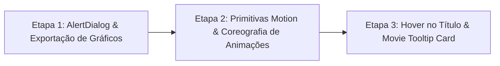

# Plano Executivo de Implementação: Animações Motion, Tooltip Cards e UX Interativa

Este documento estabelece o plano oficial de implementação dividido em **3 etapas sequenciais**, combinando animações físicas fluidas (**Motion v13 / `motion/react`**), segurança de sessão com **`AlertDialog` do shadcn (Base UI)**, exportação de gráficos em alta resolução (PNG e Data URI), e **Tooltip Cards cinemáticos no hover de títulos de filmes** (baseado no Aceternity UI com integração ao Markdown e novo endpoint no backend).

---

## 🛡️ Critério de Aceite Mandatório: Isolamento Estrito da Camada de Animação (Zero Pollution Principle)

> **Regra de Ouro de Arquitetura:**  
> **Nenhum componente funcional, de negócio, de formulário ou de chat deve ser poluído com dezenas de linhas de física de animação, variantes do Motion (`initial`, `animate`, `exit`, `variants`, `transition`) ou manipulações imperativas de DOM.**

### Padrão de Isolamento Estabelecido:
1. **Camada Dedicada de Primitivas de Animação Declarativas (`frontend/src/components/animations/`):**
   Toda lógica de física de mola, keyframes, interpolações e `AnimatePresence` deve residir em componentes atômicos reutilizáveis e fortemente tipados:
   - `<AmbientGlow />`: Aura radial de fundo com efeito de respiração contínua em escala e opacidade.
   - `<FloatingItem />`: Wrapper para levitação física suave com ciclos de translação.
   - `<DirectionalSlide />`: Wrapper sobre `AnimatePresence` gerenciando transições direcionais (slide x/y + fade + spring physics) com base em uma `activeKey`.
   - `<SlidingIndicator />`: Indicador deslizante de estado ativo para abas e cards utilizando `layoutId`.
   - `<CollapsibleMotion />`: Container sanfonado elástico que gerencia a transição física de altura (`height: "auto"` / `height: 0`) para acordeões.
   - `<StaggerContainer />` e `<StaggerItem />`: Orquestradores de entrada escalonada sequencial para listas dinâmicas.
2. **Consumo Declarativo e Limpo nas Views:**
   Componentes de domínio (como `SuggestionsExplorer.tsx`, `ProviderForm.tsx`, `NodeStepper.tsx`, `ChatContainer.tsx`) continuam simples, legíveis e focados em suas responsabilidades, apenas envelopando seus trechos nos wrappers declarativos:
   ```tsx
   // ✅ CORRETO: Componente de negócio limpo consumindo primitiva de animação
   <DirectionalSlide activeKey={activeCategory} direction="horizontal">
     <div className="grid grid-cols-1 sm:grid-cols-3 gap-2.5">
       {categoryPrompts.map((item) => (
         <PromptCard key={item.id} prompt={item} onSelect={onSelectPrompt} />
       ))}
     </div>
   </DirectionalSlide>

   // ❌ PROIBIDO: Poluir componente de negócio com inline motion e física densa
   <AnimatePresence mode="wait">
     <motion.div
       initial={{ opacity: 0, x: 24, scale: 0.98 }}
       animate={{ opacity: 1, x: 0, scale: 1 }}
       exit={{ opacity: 0, x: -24, scale: 0.98 }}
       transition={{ type: "spring", stiffness: 320, damping: 28 }}
     >
       {/* lógica de negócio misturada */}
     </motion.div>
   </AnimatePresence>
   ```
3. **Isolamento de Utilitários de Mídia e Clipboard:**
   A lógica de conversão de canvas para PNG Blob, download de arquivos e formatação de Data URI para Área de Transferência deve ser encapsulada em utilitários puros (`chartExportUtils.ts` e `clipboardRichUtils.ts`), mantendo `ChartRenderer.tsx` e `ChatMessageActions.tsx` enxutos e desacoplados.

---

## Sumário das 3 Etapas Sequenciais



1. **Etapa 1: AlertDialog Shadcn & Exportação de Gráficos (Data URI / PNG)**
   - Primitiva `AlertDialog` do shadcn (`@base-ui/react/alert-dialog`) para interceptação de saída de sessão durante streaming.
   - Utilitário puro de exportação e botões "Baixar PNG" e "Copiar Imagem" no `ChartRenderer.tsx`.
   - Cópia enriquecida da resposta em `ChatMessageActions.tsx` convertendo gráficos para Data URI base64.
2. **Etapa 2: Primitivas Motion & Coreografia Completa de Animações (`motion/react` v13)**
   - Criação da biblioteca de primitivas de animação em `src/components/animations/`.
   - Aplicação declarativa do `<AmbientGlow />` e `<FloatingItem />` no empty state do `ChatContainer.tsx`.
   - Aplicação do `<DirectionalSlide />` e `<SlidingIndicator />` em `SuggestionsExplorer.tsx` e `ProviderForm.tsx`.
   - Aplicação do `<CollapsibleMotion />` e `<StaggerItem />` no `NodeStepper.tsx`.
   - Polimento de abertura/fechamento em diálogos (`Dialog` e `AlertDialog`).
3. **Etapa 3: Hover no Título com Tooltip Card Cinemático (Aceternity UI + Markdown + Backend)**
   - Diretriz no System Prompt do agente para anotação de filmes: `[Nome](movie:sk_movie_id)`.
   - Novo endpoint no backend: `GET /analytics/movies/{movie_id}` (sinopse, poster, notas, finanças).
   - Componente `MovieTooltipCard` isolando hook de física de ponteiro e smart clamping de tela.
   - Suporte duplo no `MarkdownRenderer`: `[Nome](movie:id)` e `(Nome)[id]`.
   - Extensão do tooltip para colunas da `TableRenderer.tsx` e etapas do `NodeStepper.tsx`.

---

## 🚀 ETAPA 1: AlertDialog Shadcn & Exportação de Gráficos (Data URI / PNG)

### 1.1 Objetivo e Escopo de Negócio
Garantir integridade operacional na navegação do usuário (evitando perda involuntária de respostas durante streaming) e fornecer ferramentas de compartilhamento e exportação de dados analíticos visuais (download de imagens em PNG e inclusão de gráficos em alta resolução no clipboard ao copiar a conversa).

---

### 1.2 Arquitetura Técnica & Especificações

#### A. Primitiva `AlertDialog` (`frontend/src/components/ui/alert-dialog.tsx`)
* **Biblioteca Base:** `@base-ui/react/alert-dialog` (preset `base-lyra` configurado em `components.json`).
* **Regras de Composição:** Triggers e botões de fechamento usam `render={<Button ... />}`.
* **Estilização:** Dark Glassmorphism, bordas `border-border`, backdrop escurecido com `backdrop-blur-xs`, animações de zoom e fade.

#### B. Interceptação de Saída de Sessão em `frontend/src/App.tsx`
* **Cenário Atual:** Se o usuário clica em "Nova Conversa" ou seleciona outra conversa na Sidebar enquanto `isStreaming === true`, o sistema descarta silenciosamente o clique ou dispara o diálogo arcaico `beforeunload` do navegador.
* **Novo Fluxo:**
  1. Criação do estado de navegação pendente:
     ```ts
     const [pendingNavigation, setPendingNavigation] = useState<(() => void) | null>(null)
     ```
  2. Ao clicar em "Nova Conversa" ou outra thread durante `isStreaming`:
     - Abre o `AlertDialog` com mensagem explicativa:
       - **Título:** *"Interromper análise em andamento?"*
       - **Descrição:** *"Uma consulta analítica ao catálogo CineData está sendo processada neste momento. Se você trocar de conversa ou sair, a resposta parcial será descartada."*
       - **Botão Cancelar:** *"Continuar Consulta"* (mantém a sessão intacta).
       - **Botão Confirmar:** *"Interromper e Sair"* (aborta o stream ativo via `stream.abortStream()`, limpa o estado e executa a ação pendente).
  3. O evento `beforeunload` do navegador permanece estritamente como rede de segurança de SO para fechamento da aba.

#### C. Isolamento de Exportação de Gráficos (`chartExportUtils.ts` & `ChartRenderer.tsx`)
* **Utilitário Puro (`features/chat/lib/chartExportUtils.ts`):**
  - `downloadChartAsPng(canvas: HTMLCanvasElement, title: string): void`
  - `copyChartToClipboard(canvas: HTMLCanvasElement): Promise<boolean>`
* **Consumo em `ChartRenderer.tsx`:**
  - A barra superior do card de gráfico apenas invoca os utilitários ao clicar em "Baixar PNG" e "Copiar Gráfico", sem re-implementar lógica de canvas ou blobs dentro do componente.
  - Feedback visual de 2 segundos com ícone `Check` e texto "Copiado!".

#### D. Cópia Enriquecida com Data URI (`clipboardRichUtils.ts` & `ChatMessageActions.tsx`)
* **Utilitário Puro (`features/chat/lib/clipboardRichUtils.ts`):**
  - `copyMessageWithChartDataUri(content: string, canvasElement?: HTMLCanvasElement | null): Promise<void>`
  - Converte o canvas para Data URI base64 (`data:image/png;base64,...`).
  - Substitui o marcador ````chart```` no texto Markdown por:
    ```markdown
    
    ```
  - Escreve no clipboard com suporte multiformato (`text/plain` e `text/html`), garantindo que colar em editores ricos (Word, Google Docs, Notion, Slack) preserve o gráfico renderizado.
* **Consumo em `ChatMessageActions.tsx`:**
  - O manipulador `handleCopy` delega toda a formatação e clipboard para a função utilitária, permanecendo com menos de 10 linhas de código limpo.

---

### 1.3 Checklist da Etapa 1

- [x] **1.1 Primitiva de UI (`alert-dialog.tsx`):**
  - [x] Criar `frontend/src/components/ui/alert-dialog.tsx` com `@base-ui/react/alert-dialog` seguindo os padrões do shadcn e tokens semânticos.
  - [x] Exportar `AlertDialog`, `AlertDialogTrigger`, `AlertDialogPortal`, `AlertDialogOverlay`, `AlertDialogContent`, `AlertDialogHeader`, `AlertDialogFooter`, `AlertDialogTitle`, `AlertDialogDescription`, `AlertDialogAction`, `AlertDialogCancel`.
- [x] **1.2 Interceptação de Navegação (`App.tsx`):**
  - [x] Adicionar estado `pendingNavigation` e hook de aborto seguro de streaming.
  - [x] Interceptar botão "Nova Conversa" (`handleNewChat`) quando `isStreaming === true`.
  - [x] Interceptar seleção de histórico na Sidebar (`handleSelectThread`) quando `isStreaming === true`.
  - [x] Renderizar o `AlertDialog` com visual Dark Glassmorphism e botões de ação descritivos.
- [x] **1.3 Utilitários e Ações de Exportação (`chartExportUtils.ts` & `ChartRenderer.tsx`):**
  - [x] Criar `frontend/src/features/chat/lib/chartExportUtils.ts` com funções de download PNG e cópia de Blob.
  - [x] Conectar `useRef` ao canvas do Chart.js no `ChartRenderer.tsx`.
  - [x] Implementar botões de ação na barra superior delegando aos utilitários com feedback de 2s.
- [x] **1.4 Cópia Enriquecida da Conversa (`clipboardRichUtils.ts` & `ChatMessageActions.tsx`):**
  - [x] Criar `frontend/src/features/chat/lib/clipboardRichUtils.ts` para montagem de Markdown com Data URI e clipboard multiformato.
  - [x] Atualizar `ChatMessageActions.tsx` consumindo o utilitário limpo.
- [x] **1.5 Verificação e Testes:**
  - [x] Criar teste unitário `frontend/src/components/ui/__tests__/AlertDialog.test.tsx`.
  - [x] Criar testes unitários para `chartExportUtils.test.ts` e `clipboardRichUtils.test.ts`.
  - [x] Atualizar testes de `ChatMessageActions.test.tsx` e `ChartRenderer.test.tsx`.
  - [x] Validar com `cd frontend && bun test && bun run lint`.

---

## 🎨 ETAPA 2: Primitivas Motion & Coreografia Completa de Animações (`motion/react` v13)

### 2.1 Objetivo e Escopo de Negócio
Criar uma camada pura de animações declarativas para o design system e coreografar microinterações cinemáticas ao longo da aplicação, eliminando descontinuidades visuais e cortes bruscos com física de mola suave, **mantendo os componentes de negócio 100% limpos**.

---

### 2.2 Arquitetura Técnica & Biblioteca de Primitivas (`src/components/animations/`)

```text
frontend/src/components/animations/
├── AmbientGlow.tsx         <-- Aura radial de respiração contínua
├── FloatingItem.tsx        <-- Wrapper de levitação física periódica
├── DirectionalSlide.tsx    <-- Wrapper de transição direcional (swipe x/y + AnimatePresence)
├── SlidingIndicator.tsx    <-- Pill/halo animado deslizante via layoutId
├── CollapsibleMotion.tsx   <-- Sanfona com transição física de altura
└── StaggerList.tsx         <-- Container e itens para animação sequencial em cascata
```

#### Especificações das Primitivas:
1. **`<AmbientGlow />`:**
   - Props: `size?: 'sm' | 'md' | 'lg'`, `className?: string`, `duration?: number`.
   - Encapsula o gradiente radial CineData, o blur profundo (`blur-3xl`) e a animação contínua de respiração (`scale: [1, 1.08, 1]`, `opacity: [0.6, 0.85, 0.6]`).
2. **`<FloatingItem />`:**
   - Props: `children: React.ReactNode`, `amplitude?: number`, `duration?: number`.
   - Adiciona translação periódica sutil (`translateY: [0, -amplitude, 0]`) com curva `easeInOut`.
3. **`<DirectionalSlide />`:**
   - Props: `activeKey: string | number`, `direction?: 'horizontal' | 'vertical'`, `children: React.ReactNode`.
   - Encapsula `<AnimatePresence mode="wait">` e executa slide direcional suave com mola (`stiffness: 320, damping: 28`).
4. **`<SlidingIndicator />`:**
   - Props: `layoutId: string`, `className?: string`.
   - Renderiza o elemento com `layoutId` do Motion para deslizar entre abas ou cards ativos sem recriação brusca.
5. **`<CollapsibleMotion />`:**
   - Props: `isExpanded: boolean`, `children: React.ReactNode`, `className?: string`.
   - Gerencia a abertura e fechamento sanfonado elástico (`height: "auto"` / `0`) com `overflow-hidden` e mola (`stiffness: 260, damping: 25`).

---

### 2.3 Aplicação Declarativa nas Views de Negócio

* **Empty State do Chat (`ChatContainer.tsx`):**
  - Apenas posiciona `<AmbientGlow />` no fundo e envolve o ícone do `Clapperboard` em `<FloatingItem amplitude={5}>`. Zero motion inline em `ChatContainer.tsx`.
* **Explorador de Sugestões (`SuggestionsExplorer.tsx`):**
  - As abas usam `<SlidingIndicator layoutId="activeCategoryPill" />` sob o botão ativo.
  - O grid de 3 cards é envelopado por `<DirectionalSlide activeKey={activeTab} direction="horizontal">`.
* **Configurações de Provedores (`ProviderForm.tsx` & `ProviderCardGrid.tsx`):**
  - O card de provedor selecionado exibe `<SlidingIndicator layoutId="activeProviderHalo" />`.
  - A seção de campos dinâmicos (`ProviderFieldsSection.tsx`) é envelopada por `<DirectionalSlide activeKey={selectedProvider} direction="vertical">`.
* **Trilha de Execução (`NodeStepper.tsx` & `StepItem.tsx`):**
  - O corpo sanfonado é envelopado por `<CollapsibleMotion isExpanded={isExpanded}>`.
  - Cada novo nó emitido entra como um `<StaggerItem>` com fade e leve deslocamento horizontal.
* **Polimento de Diálogos:**
  - Suavização das propriedades de spring (escala 95% ➔ 100%) em `DialogContent` e `AlertDialogContent`.

---

### 2.4 Checklist da Etapa 2

- [ ] **2.1 Criação da Biblioteca de Primitivas (`src/components/animations/`):**
  - [ ] Criar `AmbientGlow.tsx` (gradiente radial, blur-3xl, respiração contínua).
  - [ ] Criar `FloatingItem.tsx` (levitação periódica com física suave).
  - [ ] Criar `DirectionalSlide.tsx` (slide direcional com `AnimatePresence mode="wait"`).
  - [ ] Criar `SlidingIndicator.tsx` (indicador com `layoutId`).
  - [ ] Criar `CollapsibleMotion.tsx` (acordeão sanfonado elástico com controle de altura).
  - [ ] Criar `StaggerList.tsx` (orquestrador de entrada em cascata para listas).
- [ ] **2.2 Integração Declarativa na Página Inicial (`ChatContainer.tsx`):**
  - [ ] Renderizar `<AmbientGlow />` no centro do empty state.
  - [ ] Envolver `Clapperboard` em `<FloatingItem />`.
- [ ] **2.3 Integração no `SuggestionsExplorer.tsx`:**
  - [ ] Injetar `<SlidingIndicator layoutId="activeCategoryPill" />` na aba selecionada.
  - [ ] Envolver o grid de cards em `<DirectionalSlide activeKey={activeTab}>`.
- [ ] **2.4 Integração no `ProviderForm.tsx` & `ProviderCardGrid.tsx`:**
  - [ ] Injetar `<SlidingIndicator layoutId="activeProviderHalo" />` no card de provedor ativo.
  - [ ] Envolver `ProviderFieldsSection.tsx` em `<DirectionalSlide activeKey={selectedProvider}>`.
- [ ] **2.5 Integração no `NodeStepper.tsx`:**
  - [ ] Substituir colapso booleano por `<CollapsibleMotion isExpanded={isExpanded}>`.
  - [ ] Envolver novos passos em `<StaggerItem>`.
- [ ] **2.6 Verificação e Testes:**
  - [ ] Criar testes unitários para as primitivas de animação em `components/animations/__tests__/`.
  - [ ] Garantir que `ChatContainer`, `SuggestionsExplorer`, `ProviderForm` e `NodeStepper` permaneçam sem código inline de física.
  - [ ] Validar com `cd frontend && bun test && bun run lint`.

---

## 🎬 ETAPA 3: Hover no Título com Tooltip Card Cinemático (Aceternity UI + Markdown + Backend)

### 3.1 Objetivo e Escopo de Negócio
Elevar o poder de análise da aplicação permitindo que o usuário visualize informações completas de qualquer filme citado (poster oficial, sinopse, notas comparativas IMDb/TMDB, receita e lucro em R$) apenas passando o mouse sobre o título. A solução combina uma diretriz no System Prompt do LLM, um endpoint de dados de alto desempenho no backend e um Tooltip Card desacoplado baseado na física do Aceternity UI.

---

### 3.2 Arquitetura Técnica & Especificações

#### A. Diretriz no System Prompt do Agente (`synthesizer_prompt.py`)
* Atualização no prompt do sintetizador do LangGraph orientando a anotação formal de filmes:
  ```python
  MOVIE_ANNOTATION_DIRECTIVE = (
      "[DIRETRIZ DE ANOTAÇÃO DE FILMES]:\n"
      "- Sempre que citar títulos de filmes específicos encontrados no banco de dados, "
      "inclua a referência no formato Markdown de link: `[Título do Filme](movie:sk_movie_id)` "
      "(ou alternativamente `(Título do Filme)[sk_movie_id]`).\n"
      "- Exemplo: `O filme com maior bilheteria foi [Avatar: The Way of Water](movie:b20f9a7c...)`.\n"
      "- O sk_movie_id está disponível na coluna 'sk_movie_id' da tabela dim_movies ou fact_movies_performance.\n"
      "- Isso habilita automaticamente um Card Cinemático interativo na interface com pôster, "
      "sinopse, notas e dados de bilheteria ao passar o mouse sobre o filme.\n"
  )
  ```

#### B. Endpoint Especializado no Backend: `GET /analytics/movies/{movie_id}`
* **Arquivo:** `backend/app/features/analytics/router.py` & `service.py`.
* **DTO Pydantic (`MovieDetailDTO` em `backend/app/features/analytics/schemas.py`):**
  - `sk_movie_id`, `id_filme`, `titulo`, `ano_lancamento`, `duracao_minutos`, `status_filme`.
  - `sinopse`, `url_poster`, `url_backdrop`.
  - `generos`: lista de strings agregadas.
  - `diretores`: lista de diretores do filme.
  - `nota_imdb`, `qtd_imdb`, `nota_tmdb`, `qtd_tmdb`.
  - `receita_brl`, `orcamento_brl`, `lucro_brl`.
* **Performance:** Consulta SQL indexada e segura com driver em `mode=ro`, unindo `dim_movies` e `fact_movies_performance` por `sk_movie_id` ou `id_filme`.

#### C. Componente `MovieTooltipCard` no Frontend (Arquitetura Desacoplada)
O componente é decomposto em 3 camadas independentes:

```text
frontend/src/features/chat/components/tooltip/
├── usePointerSpringPosition.ts  <-- Hook headless de física de mola e prevenção de colisão de tela
├── MoviePreviewCard.tsx         <-- Conteúdo visual puro (poster, badges, notas, sinopse, loading skeleton)
└── MovieTooltipCard.tsx         <-- Orquestrador que junta trigger + hook + popover flutuante
```

1. **`usePointerSpringPosition.ts` (Hook Headless):**
   - Rastreamento relativo das coordenadas do mouse (`clientX - rect.left`, `clientY - rect.top`).
   - Mola física do Motion (`stiffness: 200, damping: 20`).
   - *Smart Viewport Clamping*: detecção de bordas da tela (inverte o card para esquerda/cima caso encoste no limite da janela).
2. **`useMovieDetailsQuery.ts` (Cache e Prefetch TanStack Query):**
   - `staleTime: 1000 * 60 * 60` (1 hora).
   - No `onMouseEnter` do trigger, dispara imediatamente o prefetch.
   - Enquanto carrega, renderiza esqueleto Dark Glass com shimmer.
3. **`MoviePreviewCard.tsx` (Apresentação Pura):**
   - Imagem de poster com proporção cinematográfica.
   - Título oficial, ano e duração.
   - Pílulas de notas (IMDb dourado, TMDB ciano) e badges de gênero.
   - Sinopse com formatação elegante.
   - Métricas de bilheteria e lucro em R$.

#### D. Interceptação Dupla no `MarkdownRenderer.tsx`
* **Normalização Transparente:**
  Antes de alimentar a árvore do ReactMarkdown, converte ocorrências de `(Filme)[id]` para a sintaxe padrão de link `[Filme](movie:id)`:
  ```ts
  const processedContent = content.replace(
    /\(([^)]+)\)\[([a-zA-Z0-9_-]+)\]/g,
    '[$1](movie:$2)'
  )
  ```
* **Mapeamento Declarativo:**
  No objeto `components` do `ReactMarkdown`:
  ```tsx
  a: ({ href, children }) => {
    if (href?.startsWith('movie:')) {
      const movieId = href.replace('movie:', '')
      return (
        <MovieTooltipCard movieId={movieId}>
          <span className="font-semibold text-primary underline decoration-primary/40 underline-offset-4 cursor-pointer hover:decoration-primary transition-colors">
            {children}
          </span>
        </MovieTooltipCard>
      )
    }
    return <a href={href} target="_blank" rel="noopener noreferrer">{children}</a>
  }
  ```

#### E. Extensões de Uso do Tooltip Card
* **Tabela Analítica (`TableRenderer.tsx`):**
  Detecção de títulos de filmes nas células de tabelas estruturadas, ativando o preview em hover.
* **Etapas do `NodeStepper.tsx`:**
  Tooltip contextual sobre os nós do pipeline com detalhes técnicos e latência.
* **Badges de Provedores (`ProviderCardGrid.tsx`):**
  Tooltip rápido com especificações técnicas do provedor (latência, contexto, tipo de modelo).

---

### 3.3 Checklist da Etapa 3

- [ ] **3.1 Backend - Schemas e Serviço:**
  - [ ] Criar DTO `MovieDetailDTO` em `backend/app/features/analytics/schemas.py`.
  - [ ] Implementar método `get_movie_details(movie_id)` em `backend/app/features/analytics/service.py` com consulta SQL otimizada no `cinerocket.db`.
  - [ ] Adicionar endpoint `GET /analytics/movies/{movie_id}` em `backend/app/features/analytics/router.py` com `EndpointDoc`.
  - [ ] Escrever teste de integração em `backend/tests/features/test_movie_details_endpoint.py`.
- [ ] **3.2 Backend - System Prompt do Agente:**
  - [ ] Atualizar `backend/app/agent/prompts/synthesizer_prompt.py` com a diretriz `[Título](movie:sk_movie_id)`.
  - [ ] Validar conformidade nos nós de geração e síntese do LangGraph.
- [ ] **3.3 Frontend - Hook e Física de Ponteiro (Aceternity UI):**
  - [ ] Criar hook `usePointerSpringPosition.ts` com física de mola Motion e prevenção de colisão com a viewport.
  - [ ] Criar hook TanStack Query `useMovieDetailsQuery.ts` com cache de 1 hora e prefetch on hover.
  - [ ] Criar componente visual puro `MoviePreviewCard.tsx`.
  - [ ] Criar componente orquestrador `MovieTooltipCard.tsx` com expansão de altura (`scrollHeight`).
- [ ] **3.4 Frontend - Integração no `MarkdownRenderer.tsx`:**
  - [ ] Implementar normalização regex para aceitar tanto `[Filme](movie:id)` quanto `(Filme)[id]`.
  - [ ] Mapear o componente `a` do ReactMarkdown para renderizar `MovieTooltipCard` para links do protocolo `movie:`.
- [ ] **3.5 Extensões de Uso:**
  - [ ] Integrar preview de filmes na `TableRenderer.tsx`.
  - [ ] Adicionar tooltips informativos contextuais nas etapas do `NodeStepper.tsx`.
- [ ] **3.6 Verificação e Testes:**
  - [ ] Criar teste `frontend/src/features/chat/components/tooltip/__tests__/MovieTooltipCard.test.tsx`.
  - [ ] Testar renderização de Markdown com links `movie:` em `MarkdownRenderer.test.tsx`.
  - [ ] Executar validação completa: `cd frontend && bun test && bun run lint && cd ../backend && uv run pytest tests/features/test_movie_details_endpoint.py`.

---

## 📋 Resumo da Rastreabilidade de Arquivos

| Etapa | Ação | Arquivo | Finalidade |
| :---: | :--- | :--- | :--- |
| **1** | **Criar** | `frontend/src/components/ui/alert-dialog.tsx` | Componente `AlertDialog` Base UI do shadcn. |
| **1** | **Modificar** | `frontend/src/App.tsx` | Interceptação de saída/troca de sessão durante streaming. |
| **1** | **Criar** | `frontend/src/features/chat/lib/chartExportUtils.ts` | Utilitário puro de download PNG e cópia de Blob de canvas. |
| **1** | **Criar** | `frontend/src/features/chat/lib/clipboardRichUtils.ts` | Utilitário puro de formatação de mensagens com Data URI para clipboard. |
| **1** | **Modificar** | `frontend/src/features/chat/components/renderers/charts/ChartRenderer.tsx` | Botões "Baixar PNG" e "Copiar Gráfico" delegando aos utilitários. |
| **1** | **Modificar** | `frontend/src/features/chat/components/feed/ChatMessageActions.tsx` | Cópia enriquecida delegando a `clipboardRichUtils`. |
| **1** | **Criar** | `frontend/src/components/ui/__tests__/AlertDialog.test.tsx` | Testes do componente `AlertDialog`. |
| **2** | **Criar** | `frontend/src/components/animations/AmbientGlow.tsx` | Primitiva atômica de aura radial de respiração contínua. |
| **2** | **Criar** | `frontend/src/components/animations/FloatingItem.tsx` | Primitiva atômica de levitação periódica suave. |
| **2** | **Criar** | `frontend/src/components/animations/DirectionalSlide.tsx` | Primitiva atômica de slide direcional com `AnimatePresence`. |
| **2** | **Criar** | `frontend/src/components/animations/SlidingIndicator.tsx` | Primitiva atômica de pill/halo dinâmico com `layoutId`. |
| **2** | **Criar** | `frontend/src/components/animations/CollapsibleMotion.tsx` | Primitiva atômica de acordeão sanfonado elástico. |
| **2** | **Criar** | `frontend/src/components/animations/StaggerList.tsx` | Primitiva atômica de entrada sequencial em cascata. |
| **2** | **Modificar** | `frontend/src/features/chat/ChatContainer.tsx` | Consumo declarativo de `<AmbientGlow />` e `<FloatingItem />`. |
| **2** | **Modificar** | `frontend/src/features/chat/components/empty-state/SuggestionsExplorer.tsx` | Consumo declarativo de `<DirectionalSlide />` e `<SlidingIndicator />`. |
| **2** | **Modificar** | `frontend/src/features/settings/components/form/ProviderForm.tsx` | Consumo declarativo de `<SlidingIndicator />` e `<DirectionalSlide />`. |
| **2** | **Modificar** | `frontend/src/features/chat/components/feed/NodeStepper.tsx` | Consumo declarativo de `<CollapsibleMotion />` e `<StaggerItem />`. |
| **3** | **Modificar** | `backend/app/agent/prompts/synthesizer_prompt.py` | Diretriz formal de anotação de filmes `[Filme](movie:id)`. |
| **3** | **Criar** | `backend/app/features/analytics/schemas.py` | DTO `MovieDetailDTO` com sinopse, poster, notas e métricas. |
| **3** | **Modificar** | `backend/app/features/analytics/service.py` | Consulta SQL indexada de detalhes do filme no `cinerocket.db`. |
| **3** | **Modificar** | `backend/app/features/analytics/router.py` | Rota `GET /analytics/movies/{movie_id}`. |
| **3** | **Criar** | `frontend/src/features/chat/components/tooltip/usePointerSpringPosition.ts` | Hook headless de física de mola e prevenção de colisão de tela. |
| **3** | **Criar** | `frontend/src/features/chat/components/tooltip/MoviePreviewCard.tsx` | Conteúdo visual puro do card (poster, badges, notas, sinopse). |
| **3** | **Criar** | `frontend/src/features/chat/components/tooltip/MovieTooltipCard.tsx` | Orquestrador limpo unindo trigger + hook + preview popover. |
| **3** | **Criar** | `frontend/src/features/chat/hooks/useMovieDetailsQuery.ts` | Hook TanStack Query com prefetch e cache para detalhes do filme. |
| **3** | **Modificar** | `frontend/src/features/chat/components/renderers/MarkdownRenderer.tsx` | Suporte duplo `[Filme](movie:id)` e `(Filme)[id]`. |
| **3** | **Criar** | `backend/tests/features/test_movie_details_endpoint.py` | Testes do endpoint de detalhes do filme. |
| **3** | **Criar** | `frontend/src/features/chat/components/tooltip/__tests__/MovieTooltipCard.test.tsx` | Testes do componente de preview de filmes. |
